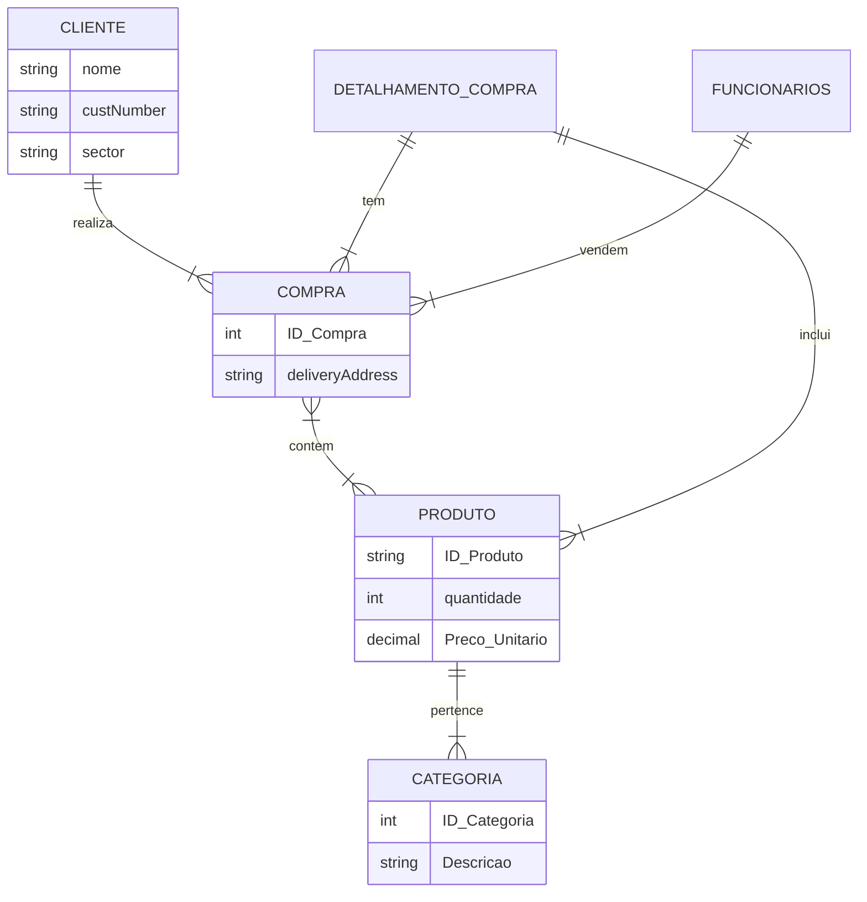

# Banco de Dados 2

Repositório destinado para projeto da disciplina Banco de Dados 2.

## Descrição do projeto

O projeto visa criar um banco de dados relacional referente a um sistema de exportações de bens de consumo. O banco contém informações sobre clientes, produtos, vendas, categorias e funcionários dessa empresa de exportação.

Os modelos conceitual e relacional serão apresentados a seguir. A base de dados utilizada para construção deste projeto foi disponibilizada pela Microsoft no banco chamado [Northwind](https://github.com/microsoft/sql-server-samples/tree/master/samples/databases/northwind-pubs).

## Requisitos do projeto

- [ ] Criar no mínimo 4 relações (tabelas)  
- [ ] Garantir que ao menos algumas sejam ligadas por chaves estrangeiras (sejam relacionadas)
- [ ] Criar scripts para povoar as tabelas
- [ ] Criar ao menos 2 visões que produzam visualizações úteis 
- [ ] Criar 2 funções que produzam resultados úteis
- [ ] Criar 2 triggers que alterem o estado das relações
- [ ] Criar consultas de testes para demonstrar o funcionamento das visões, triggers e consultas.

